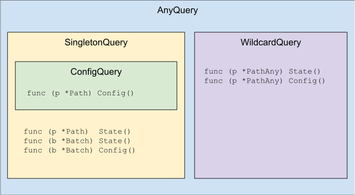

# ygnmi

## Introduction

ygnmi is a A Go gNMI client library based on [ygot](github.com/openconfig/ygot)-generated code. It includes a generator whose input is a set of YANG modules and output is ygot Go structs and a path library that can be used for making gNMI queries.

The library supports querying telemetry and unmarshaling it into generated structs and setting config. Only gnmi.Subscribe and gnmi.Set RPC are supported by this library.

This project is under active development and does not provide any compatibility or stability guarantees.

Note: This is not an official Google product.

## Generation

The ygnmi generator can be installed by running: `go install github.com/openconfig/ygnmi/app/ygnmi@latest`.

For the most up-to-date documentation of the generator commands and flags: use the built-in `help` command. ygnmi can be configured using (in order of precedence): flags, environment variables, or a config file. 
An example generation script is located at internal/exampleoc/gen.sh.

Not all ygot generator flags are supported by ygnmi. Notably ygnmi makes two important assumptions about the generated code:

1. Path compression is enabled.
2. PreferOperationState is selected.

Note: the supported flags may evolve over time to include these options.

### Output

Calling the generation with `--base_import_path=<somepath>/exampleoc` flag will output:

* exampleoc
    * This package contains the structs, enums, unions, and schema.
    * These correspond to **values** that can be returned or set.
* exampleoc/\<module\>
    * For every YANG module (that defines at least one container) one Go package is generated.
    * Each package contains PathStructs: structs that represent a gNMI **path** that can queried or set.
    * Each PathStruct has a State() method that returns Query for path. It may also have a Config() method. 
* exampleoc/root
    * This package contains a special "fakeroot" struct.
        * It is called the fakeroot because there is no YANG container that corresponds to this struct.
    * The package also contains a batch struct.

## gNMI Client Library

The ygnmi client library uses the generated code to perform schema compliant subscriptions and set gNMI RPCs. 

### gNMI path to ygnmi path

ygnmi paths mimic with gNMI paths with a few transformations applied.

1. Names are CamelCased: `network-instance` -> `NetworkInstance`
2. YANG module names are omitted, and added to a root struct: `/openconfig-network-instance/network-interfaces/` -> `ocpath.Root().NetworkInstance()`
3. Lists are compressed: `network-instances/network-instance[name=DEFAULT]` -> `NetworkInstance("DEFAULT")`
4. List keys can be specified several ways:
    1. Fully by specifying all keys: `protocols/protocol[identifier=BGP][name=test]` -> `Protocol(oc.PolicyTypes_INSTALL_PROTOCOL_TYPE_BGP, "test")`
    2. Specifying no keys: `protocols/protocol[identifier=*][name=*]` -> `ProtocolAny()`
    3. Specifying some keys: `protocols/protocol[identifier=BGP][name=*]` -> `ProtocolAny().WithIdentifier(oc.PolicyTypes_INSTALL_PROTOCOL_TYPE_BGP)`
5. State or Config are specified at the end: `interface[name=eth0]/state/name` -> `Interface("eth0").Name().State()`

Examples:

|gNMI Path|ygnmi Call|
|---------|----------|
|`/network-instances/network-instance[name=DEFAULT]/protocols/protocol[identifier=BGP][name=test]/bgp/neighbors/neighbor[neighbor-address=localhost]/state/description`|`ocpath.Root().NetworkInstance("DEFAULT").Protocol(oc.PolicyTypes_INSTALL_PROTOCOL_TYPE_BGP, "test").Bgp().Neighbor("localhost").Description().State()`
| `/interfaces/interface[name=*]/config/name` | `ocpath.Root().InterfaceAny().Name().Config()`

Note: It is highly recommended to use this library with an IDE or autocomplete configured.

### Queries

The ygnmi library uses generic queries to represent a gNMI path, the value type, and schema. Queries should never be constructed directly.
Instead, they are returned by calling .Config() or .State() on the generated code. There are several query types that allow type safety when running an operation.
The relationship of the query types is:

* Singleton: Lookup, Get, Watch, Await, Collect
* Config: Update, Replace, Delete, BatchUpdate, BatchReplace, BatchDelete
* Wildcard: LookupAll, GetAll, WatchAll, CollectAll

## Noncompliance Errors

ygnmi detects and reports noncompliance errors in any data or paths it receives.
As explained in greater detail below, there three kinds of noncompliance errors
that ygnmi detects: *Path Noncompliance*, *Type Noncompliance*, and *Value
Noncompliance*.

### Noncompliance Reporting

When executing a non-wildcard leaf query, every kind of noncompliance error is
returned as a hard error from the ygnmi API call. However, when executing any
other kind of query (i.e. a wildcard and/or non-leaf query), noncompliance
errors are logged and made available for further inspection through the
[`Compliance Errors` field](https://github.com/openconfig/ygnmi/blob/fc0ed1e49141ed7de0666c610906697d2f025d7f/ygnmi/ygnmi.go#L95)
of the `ygnmi.Value` type.

The reason for avoiding hard errors when executing a wildcard and/or non-leaf
query is that the noncompliant data received in these cases is often unrelated
to the data under test. The noncompliant data is often gathered only as a
byproduct of querying for compliant data that the test *does* care about. For
example, a test using `gnmi.Collect` may receive noncompliant Deletes when it
cares test cares only about Updates; or a test using `gnmi.Get` on a container
may receive noncompliant leaves unrelated to the leaves of interest.

### Path Noncompliance

Path noncompliance occurs when the path received from the system is invalid.
This could be due to the path (a) not matching the query path, (b) referring to
a node that doesn't exist in the YANG schema, or (c) being malformed due to
using deprecated proto fields.

**Node name mismatch**
* Query: `/interfaces/interface[name="eth1"]/state/counters/in-octets`
* Received: `/interfaces/interface[name="eth1"]/state/counters/out-octets`

**Key name mismatch**
* Query: `/interfaces/interface[name="eth1"]`
* Received: `/interfaces/interface[name="eth2"]/state/counters/out-octets`

**Non-existent path**
* Query: `/interfaces/interface[name="eth1"]/state/counters`
* Received: `/interfaces/interface[name="eth1"]/state/counters/bogus-field`

### Type Noncompliance

Type noncompliance occurs when the received path is valid, but the value cannot
be unmarshalled into the `GoStruct` by `ygot`. This could be due to (a) the
received type not matching what is defined in the YANG schema (e.g. received
string instead of uint32), or (b) when an enum value doesn't match one of the
values defined for that enum in the YANG schema.

**Type mismatch**
* Query: `/interfaces/interface[name="eth1"]`
* Received: `/interfaces/interface[name="eth1"]/state/counters/out-octets, "foo"`

### Value Noncompliance

Value noncompliance occurs when the received path is valid and the type *can* be
unmarshalled into the `GoStruct` by `ygot`, but validation of its value by
`ygot` fails. This could be due to, for example, a string that doesn't match its
regex as specified in its YANG schema, or a list key value that doesn't match
the corresponding value in its path.

**YANG Type Restriction noncompliance**
* Query: `/interfaces/interface[name="\*"]`
* Received: `/interfaces/interface[name="eth1"]/ethernet/state/mac-address, "zz:zz:zz:zz:zz:zz"`

**YANG List Key value mismatch**
* Query: `/interfaces/interface[name="eth1"]`
* Received (or not received at all): `/interfaces/interface[name="eth1"]/ethernet/state/name, "eth2"`

## Additional Reference

* See [ygot](github.com/openconfig/ygot) for more information on how YANG is mapped to Go code.
* See [gNMI](github.com/openconfig/gnmi) and [gNMI Reference](https://github.com/openconfig/reference/tree/master/rpc/gnmi) for more information on the gNMI protocol and spec.
